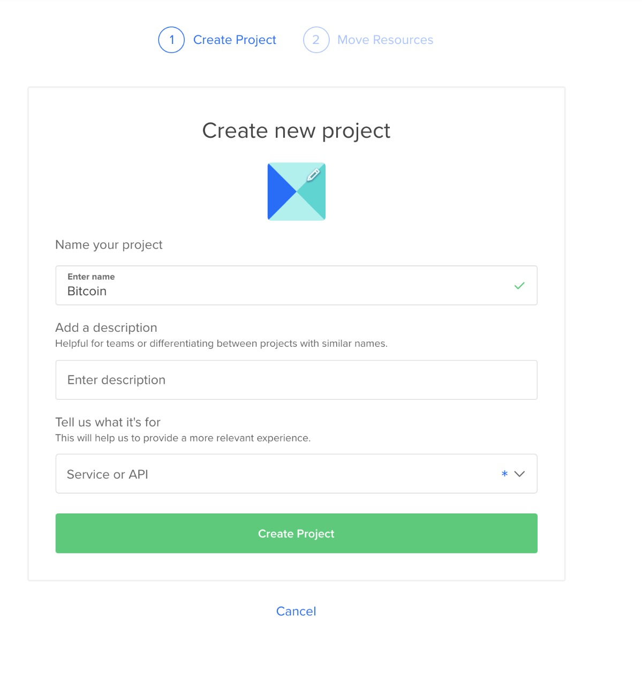
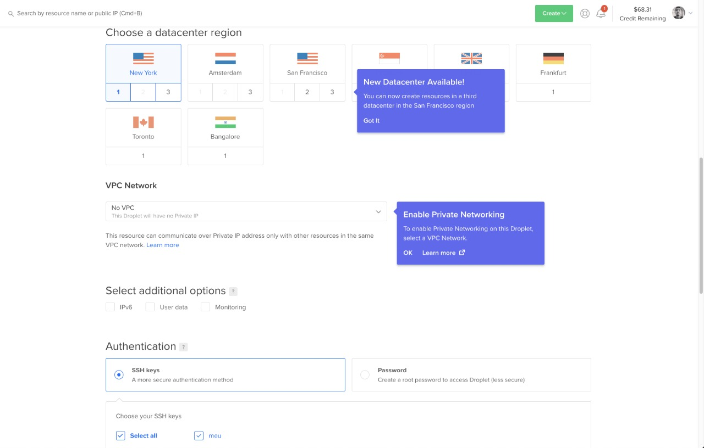

# Bitcoin development mode + FullNode

Existem diversas maneiras de subir um ambiente de desenvolvimento para que seja possível testar, manipular e interagir com a [blockchain](https://descentralizado.com.br/2017/09/14/introducao-ao-blockchain/) do Bitcoin. No final deste artigo você será capaz de realizar a configuração de um fullnode em modo de desenvolvimento.

## Step 1 - Criar uma conta em uma servidor de VPS

Nesta etapa irei utilizar a VPS da [DigitalOcean](https://m.do.co/c/ff9725e7d70a), caso não possua um usuário, voce pode fazer um cadastro no link anterior e receber 100 dólares para testar por um período de 60 dias.

## Criando um droplets

Acesse sua conta, clique em **New Project**, insira os  dados abaixo e clique em **Create Project**:



Acesse seu Projeto e clique em **Create** -> **Droplets**


### Configurando nosso Droplets 

As configuracoes serao as seguintes:

**Distributions:** Ubunto

**Plan:** Basic

**Standard virtual machines:** 80/mo


**Datacenter Region:** New York
**Authentication:** SSH

Clique em **New SSH Key** para cadastrar sua SSH key, se voce desconhece a autenticação via SSH não há nenhum problema, pois quando for cadastrar uma nova chave, a propriá pagina irá lhe ensinar como gerar a sua.


Siga o passo a passo para gerar a sua ssh key, de um nome para a mesma e clique em **Add SSH Key** e selecione o nome da sua chave na tela principal.

*Não irei abordar conceitos sobre criptografia assimétrica e simétrica, caso possua interesse no assunto deixe nos comentários, assim irei criar um artigo exclusivo para esses conceitos.*



Para finalizar clique em **Create Droplet**, se tudo ocorrer como o esperado voce sera redirecionado para essa tela.


### Acessando nosso Droplet via Terminal

Ótimo se voce chegou ate aqui, concluiu todas as etapas corretamente, caso contrario realize todos os passos novamente.

Para acessar a nossa **VPS** abra seu **Terminal** e digite:

```
ssh root@ [Ip da sua VPS] 
```
Devera se parecer como isso:

```
ssh root@167.172.154.136
```
Será solicitado a senha da sua chave ssh (caso tenha criado uma ssh com password), em caso de solicitar permissão escreva **yes**

**Yes**: Solicitando permissão para conectar a um host desconhecido, o parâmetro *Yes* adicionara esse host em host conhecidos pela sua maquina, isso evita que programas maliciosos conectem a host sem a sua permissão.

Onde está **ECDSA key fingerprint is SHA256:xxxxxxxxxxxxxxxxxxxxxxxxxxxxxxxxxxx.** ira mostrar a sua chave, ocultei a minha por seguranca, pois **esse tipo de informação NUNCA DEVE SER COMPARTILHADA NO AMBIENTE ONLINE**

```
❯ ssh root@167.172.154.136             

The authenticity of host '167.172.154.136 (167.172.154.136)' can't be established.
ECDSA key fingerprint is SHA256:xxxxxxxxxxxxxxxxxxxxxxxxxxxxxxxxxxx.
Are you sure you want to continue connecting (yes/no/[fingerprint])? yes
Warning: Permanently added '167.172.154.136' (ECDSA) to the list of known hosts.
Enter passphrase for key '/Users/[YOUR-USER]/.ssh/[YOUR-KEY]': 
```
Posteriormente se tudo ocorrer bem com suas credenciais conseguira acessar a **VPS**:

```
Welcome to Ubuntu 18.04.4 LTS (GNU/Linux 4.15.0-66-generic x86_64)

 * Documentation:  https://help.ubuntu.com
 * Management:     https://landscape.canonical.com
 * Support:        https://ubuntu.com/advantage

  System information as of Tue Jul 28 23:03:27 UTC 2020

  System load:  0.03               Processes:           125
  Usage of /:   9.4% of 309.96GB   Users logged in:     0
  Memory usage: 5%                 IP address for eth0: 159.89.53.60
  Swap usage:   0%

 * Canonical Livepatch is available for installation.
   - Reduce system reboots and improve kernel security. Activate at:
     https://ubuntu.com/livepatch

2 packages can be updated.
0 updates are security updates.


*** System restart required ***
Last login: Fri Jul 24 04:38:12 2020 from 45.225.237.23
root@ubuntu-s-6vcpu-16gb-nyc1-01:~# 
```

Legal! Agora já estamos acessando nossa VPS na Digital Ocean pelo terminal ⚡️, mas vamos continuar, o show nao pode parar 🤟🏻.

Sempre que acessamos a primeira vez uma VPS precisamos atualizar seus pacotes e softwares, para isso digite:

```
apt-get update && apt-get upgrade
```
**apt-get update:** Busca por atualizações.

**apt-get upgrade** Realiza as atualizações.

Esse processo pode demorar alguns minutos, tenha paciência.

Mantenha seu servidor sempre atualizado:

```
echo "unattended-upgrades unattended-upgrades/enable_auto_updates boolean true" | debconf-set-selections && apt-get -y install unattended-upgrades

```

## Instalando o Bitcoin FullNode Testnet

Vamos primeiramente configurar algumas variáveis de ambiente com o seguinte comando:

```
sudo cat >> .bash_profile <<EOF
alias btcdir="cd ~/.bitcoin/" #linux default bitcoind path
alias bc="bitcoin-cli"
alias bd="bitcoind"
alias btcinfo='bitcoin-cli getwalletinfo | egrep "\"balance\""; bitcoin-cli getinfo | egrep "\"version\"|connections"; bitcoin-cli getmininginfo | egrep "\"blocks\"|errors"'
alias btcblock="echo \\\`bitcoin-cli getblockcount 2>&1\\\`/\\\`wget -O - http://blockexplorer.com/testnet/q/getblockcount 2> /dev/null | cut -d : -f2 | rev | cut -c 2- | rev\\\`"
EOF
```

Crie uma copia para Shell (linhas de comando) interativas:

```
cp .bash_profile .bashrc
```

## Variáveis ​​de instalação

Agora vamos criar variáveis de instalação, iremos utilizar a ultima instável do bitcoin, que atualmente esta sendo a **bitcoin-core-0.20.0**, com isso digitamos em nosso terminal os seguintes comandos:

```
export BITCOIN=bitcoin-core-0.20.0
export BITCOINPLAIN=`echo $BITCOIN | sed 's/bitcoin-core/bitcoin/'`
```

## Download dos arquivos necessários

Vamos fazer o download dos arquivos necessário com o **wget** command:  

1- Imagem instalador do bitcoin core
```
wget https://bitcoin.org/bin/$BITCOIN/$BITCOINPLAIN-x86_64-linux-gnu.tar.gz -O $BITCOINPLAIN-x86_64-linux-gnu.tar.gz
```
Esse processo pode demorar alguns minutos, tenha paciência.


2- Imagem do SHA256SUMS, ele é usado posteriormente para confirmar a integridade do download.
```
wget https://bitcoin.org/bin/$BITCOIN/SHA256SUMS.asc -O SHA256SUMS.asc
```

```
wget https://bitcoin.org/laanwj-releases.asc -O laanwj-releases.asc
```

Agora ja possuímos os arquivo necessários para a configuração, para localizar os arquivos digite no seu terminal:

```
ls
```

Sera exibido todos os arquivos o diretório atual:

```
root@ubuntu-s-6vcpu-16gb-nyc1-01:~# ls

SHA256SUMS.asc  bitcoin-0.20.0-x86_64-linux-gnu.tar.gz  laanwj-releases.asc
```

## Verifique a integridade dos arquivos

Este passo e fundamental para nos termos a certeza que os dados que recebemos vieram de fato sem nenhuma adulteração. Esse processo é muito conhecido pela comunidade open-source pois permite que as pessoas possam comprovar por meio de um algoritmo de Hashing a integridade dos dados, pois se houver algum tipo de adulteração o hashing nao ira ser o mesmo gerado pelos desenvolvedores.

Nao sabe o que é Hashing? acesse esse meu outro [artigo](https://descentralizado.com.br/2017/09/14/introducao-ao-blockchain/) onde explico com detalhes o que é e para que ele é usado.

### Verificando Assinatura

```
gpg --import laanwj-releases.asc
```
```
gpg --verify SHA256SUMS.asc
```

Apos execuutar o comando procure pelo retorno onde diz:

```
gpg: Good signature from "Wladimir J. van der Laan (Bitcoin Core binary release signing key) <laanwj@gmail.com>"  
```

### Verificando Integridade

```
sha256sum $BITCOINPLAIN-x86_64-linux-gnu.tar.gz | awk '{print $1}'
```
```
cat SHA256SUMS.asc | grep $BITCOINPLAIN-x86_64-linux-gnu.tar.gz | awk '{print $1}'
```

## Instalando Bitcoin Core

### Descompactando nosso instalador

```
tar xzf $BITCOINPLAIN-x86_64-linux-gnu.tar.gz
```

### Instalando
```
sudo /usr/bin/install -m 0755 -o root -g root -t /usr/local/bin $BITCOINPLAIN/bin/*
```

### Excluindo os arquivos compactados

```
rm -rf $BITCOINPLAIN
```


## Configurando nosso no como Testnet

### Criando o diretório de referencia

```
mkdir .bitcoin
```

Observação: Em sistemas operacionais base Unix, quando um diretório inicia com ponto(.) ele sera um diretório oculto, para voce poder verificar se criou corretamente digite:

```
ls -a
```
**-a** essa opção diz ao sistema operacional que voce deseja listar todos (-all) os diretórios.

### Criando nosso rpcauth

Desde a versão **0.18.0** do bitcoin, o campo **rpcuser** nao é mais suportado, para isso precisamos adcionar outro campo o **rpcauth** que segue a seguinte estrutura:

**rpcauth:** [User]:[SALT]:[HASH]

Nos nao conseguimos gerar esses dados na mao, para isso existe uma biblioteca do próprio **Bitcoin Core**. Primeiramente precisamos fazer download do repositório bitcoin no github:

```
git clone https://github.com/bitcoin/bitcoin
```
Apos essa etapa cconcluir digite:

``` 
cd bitcoin/share/rpcauth
```
execute o script **rpcauth.py**
```
python3 rpcauth.py [YOUR-USER]
```
Em meu caso ficou assim:
```
python3 rpcauth.py dkdaniz
```
Logo em seguida sera mostrado para voce dois campos o Auth e o Password, anote ambos.

```
python3 rpcauth.py dkdaniz

String to be appended to bitcoin.conf:
rpcauth=dkdaniz:2e0c583a768dff9ceeb77529fab0fa9b$92f8d902830b8567438421d20dadd283bc61fbbb051f9c3558ca3ea0208cd57a
Your password:
iHrwS8nc70_qOTkT-iyURAtSN2a18NTJOfKxY2bkWtA=
```

### Criando o arquivo de configuração

volte ao diretorio inicial:

```
cd ~/
```
ou
```
cd ../../../
```

Mude os campos **rpcauth** para os dados gerados no passo anterior, bem como a senha também. Altere o arquivo com seus dados, copie e cole em seu terminal.

```
cat >> .bitcoin/bitcoin.conf << EOF
chain=test

rpcauth=dkdaniz:2e0c583a768dff9ceeb77529fab0fa9b$92f8d902830b8567438421d20dadd283bc61fbbb051f9c3558ca3ea0208cd57a
rpcpassword:iHrwS8nc70_qOTkT-iyURAtSN2a18NTJOfKxY2bkWtA=

server=1
rest=1

[test]

deprecatedrpc=accounts
deprecatedrpc=addwitnessaddress
deprecatedrpc=signrawtransaction
deprecatedrpc=validateaddress

# daemon = 1
rpcbind = 0.0.0.0:18332
rpcallowip = 0.0.0.0/0
EOF

```
Crie um politica de reinicialização, assim sempre que o servidor reiniciar ele irá levantar o Nó do bitcoin automaticamente.

```
( /usr/bin/crontab -l 2>/dev/null; echo "@reboot /usr/local/bin/bitcoind -daemon" ) | /usr/bin/crontab
```

## Inicializando Bitcoin Testnet

```
bitcoind -daemon
```

## Verificar a execução

Agora esta tudo certo, seu no esta sendo sincronizado com a rede bitcoin testnet, para verificar qual bloco ele está no processo de download execute o seguinte comando:

```
btcblock
```

Sera exibido o ultimo bloco sincronizado
```
761671
```
Para realizar request de fora do servidor, voce pode realizar um request **HTTP** do tipo **POST**, mas isso só ira funcionar depois que todos os blocos forem sincronizados.

```
curl --user [YOUR-USER]:[YOUR-PASSWORD]--data-binary '{"jsonrpc":"1.0","method":"getblockchaininfo","params":[]}' -H 'content-type:text/plain;' http://[IP-DO-SEU-VPS]:18332/
```

**YOUR-USER** é o usuario definido na geracao do seu rpcauth, no meu caso foi **dkdaniz**
**YOUR-PASSWORD** senha que gerada no procecsso do rpcAuth, em meu caso foi **iHrwS8nc70_qOTkT-iyURAtSN2a18NTJOfKxY2bkWtA=**
**IP-DO-SEU-VPS** Ip do seu servidor, em meu caso é **167.172.154.136**


## Duvidas e sugestões deixe nos comentários que terei a imensa honra de responder e ajudar